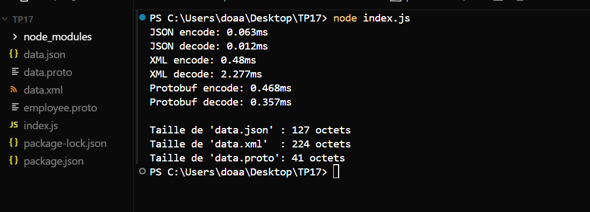

## Serialization Performance Comparison (JSON, XML, Protobuf)

The following execution shows a performance comparison between
**JSON**, **XML**, and **Protocol Buffers** using a Node.js script.

The benchmark measures:
- Encoding time
- Decoding time
- Serialized file size

### Results Summary
- **JSON**: Fast encoding/decoding, readable but larger size
- **XML**: Slower decoding and larger size
- **Protobuf**: Best performance and smallest size

### Execution Output

